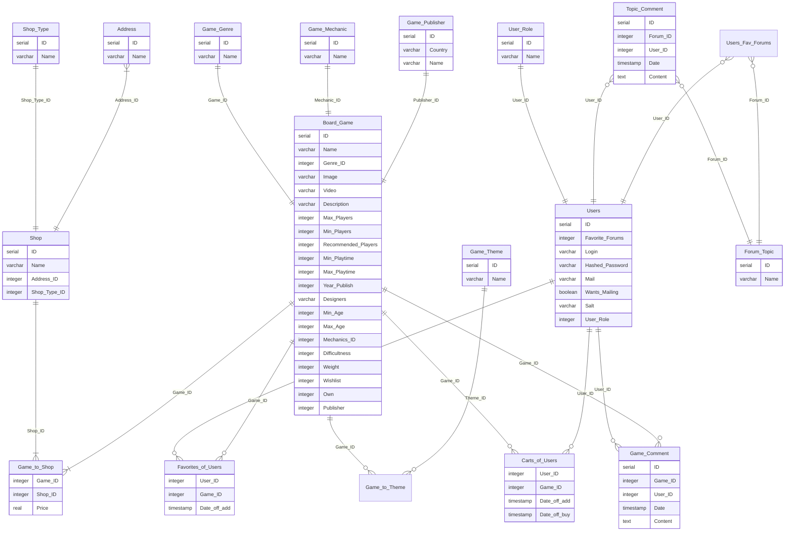

# DB_Cursework_3
Реализовать даталогическую модель в реляционной СУБД PostgreSQL:

* Создать необходимые объекты базы данных.
* Заполнить созданные таблицы тестовыми данными.
* Сделать скрипты для:
  * создания/удаления объектов базы данных;
  * заполнения/удаления созданных таблиц.
* Обеспечить целостность данных при помощи средств языка DDL.
* Добавить в базу данных триггеры для обеспечения комплексных ограничений
целостности.
* Реализовать функции и процедуры на основе описания бизнес-процессов (из этапа
№1).
* Произвести анализ использования созданной базы данных:
  * выявить наиболее часто используемые запросы к объектам базы данных;
  * результаты представить в виде текстового описания. 
# ER-модель

  
